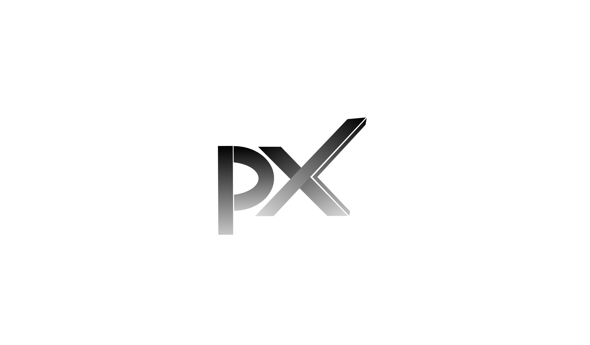

# 🚀 Proxenixx – Web Agency Portfolio

Proxenixx is a modern and responsive web portfolio built using **Next.js** and **Tailwind CSS**. Designed for startups, agencies, and freelancers, it showcases services, projects, and branding with elegance and speed.

---

## 🛠 Tech Stack

- **Framework**: [Next.js](https://nextjs.org/)
- **Styling**: [Tailwind CSS](https://tailwindcss.com/)
- **Icons**: [Lucide Icons](https://lucide.dev/) / Heroicons
- **Animations**: [Framer Motion](https://www.framer.com/motion/) or [GSAP](https://greensock.com/gsap/)
- **Hosting**: Vercel / Netlify / VPS
- **Contact Form**: Google Form or Formspree (optional)

---

## 📂 Project Structure
/proxenixx
├── public/
│ └── images/ # Static assets like logo, banners
├── components/ # Reusable React components (Navbar, Hero, Services, etc.)
├── pages/
│ ├── index.js # Homepage
│ ├── contact.js # Contact form page
│ └── _app.js # Global styles and layout
├── styles/
│ └── globals.css # Tailwind + custom CSS
├── tailwind.config.js # Tailwind theme and customization
├── next.config.js # Next.js config
├── .env.local # API keys or env vars (if needed)
└── README.md

---

## ⚙️ Getting Started

1. Clone the Repository

bash
git clone https://github.com/codegenandteam/proxenixx.git
cd proxenixx

2. Install Dependencies
bash
npm install
# or
yarn install

3. Run Development Server
   npm run dev
